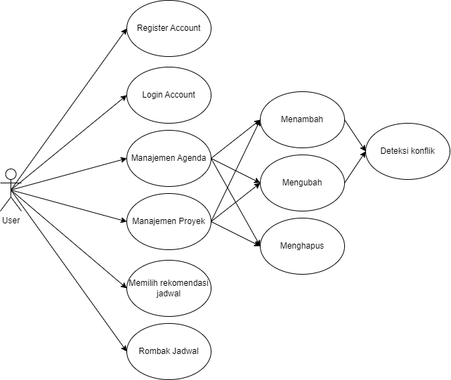
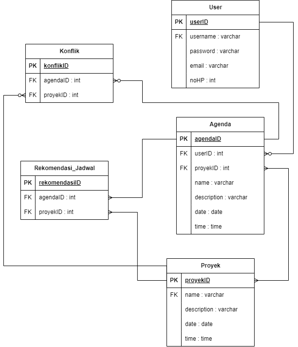
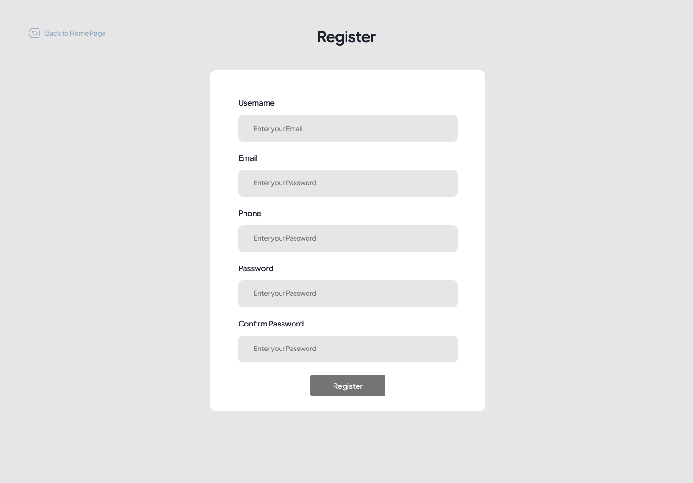
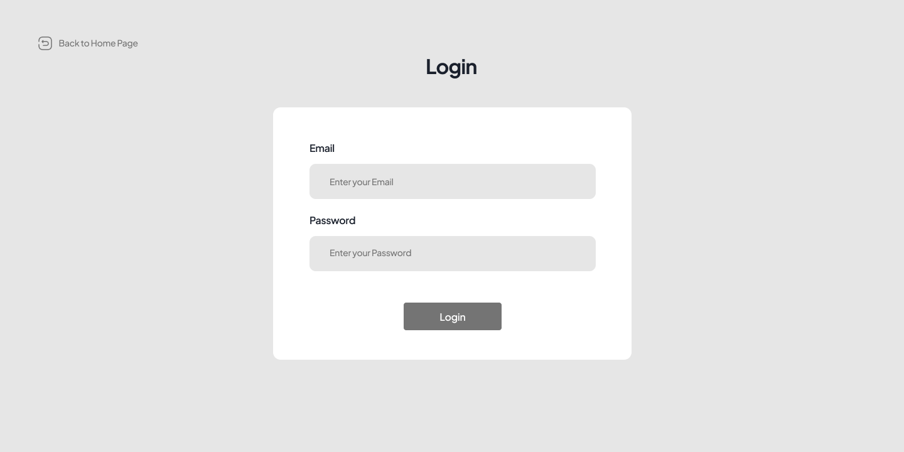
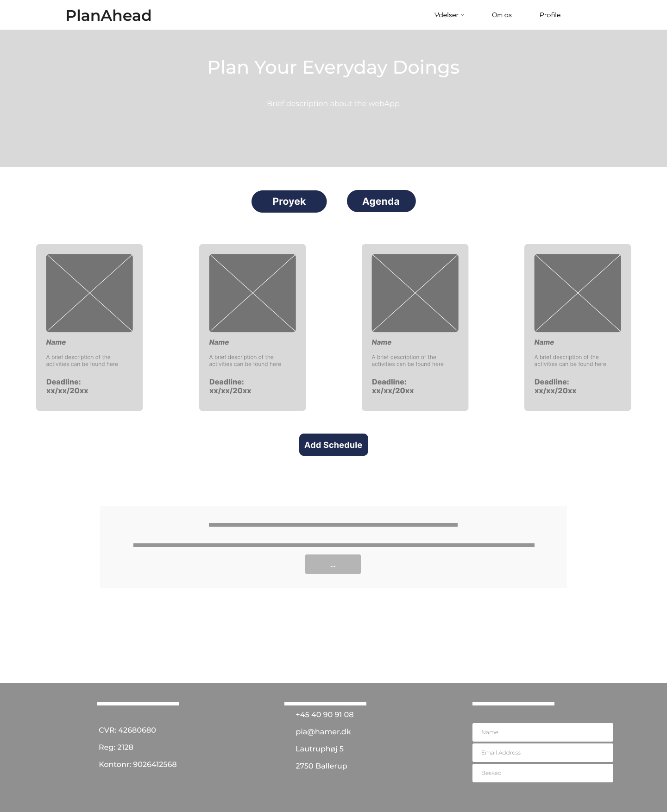
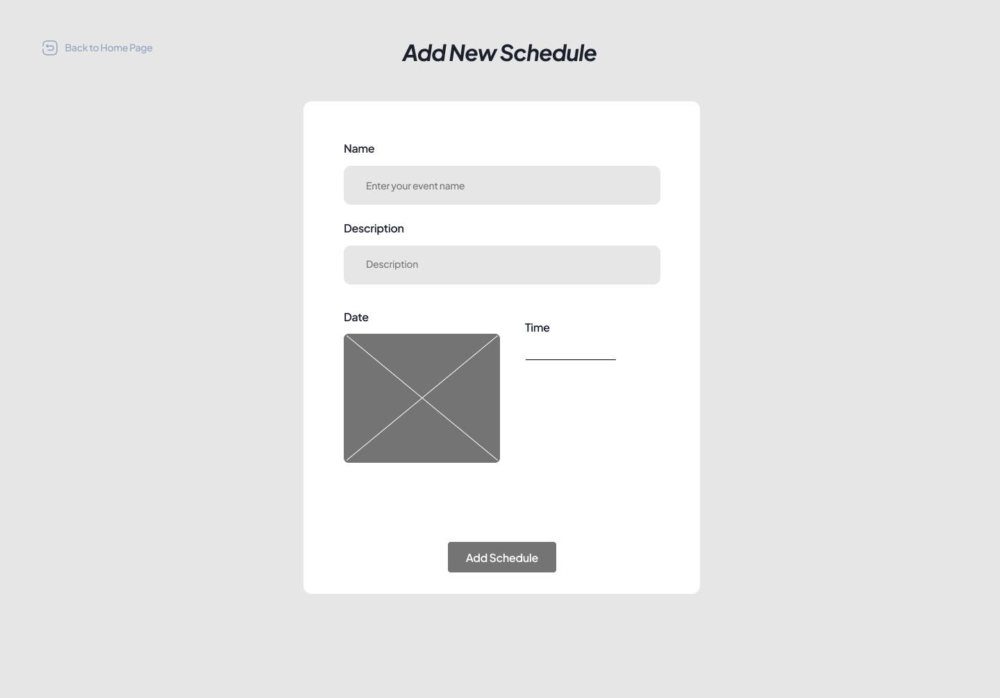
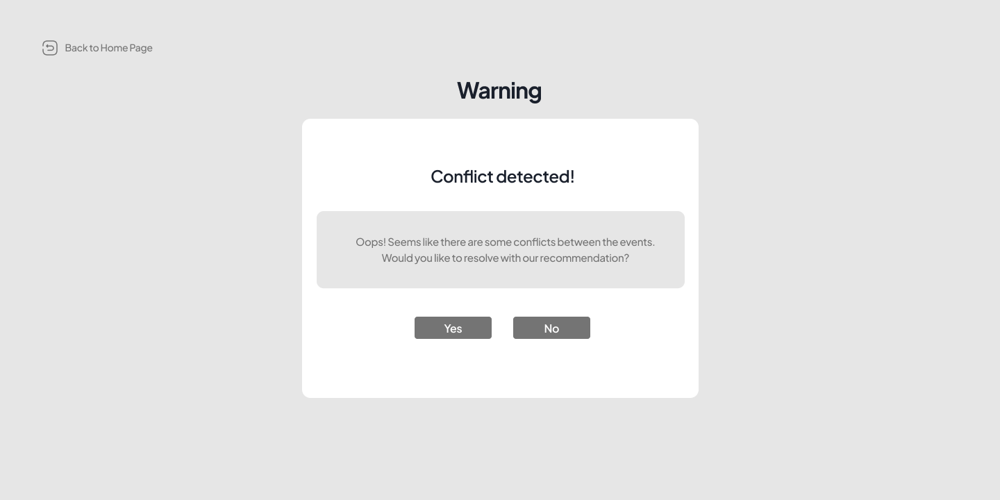
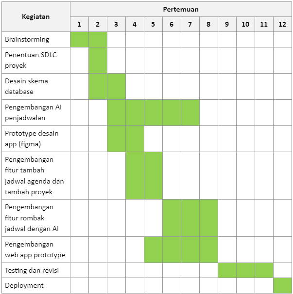

# PlanAhead
### Kelompok Random (12)
#### Anggota:
* Muhammad Azka Adhisetama 21/477807/TK/52628
* Julius Evan Adipramana Raharja Suryanto 21/482618/TK/53326
* Pranawa Dinanta Adhyarta Putra 21/482959/TK/53395
### Senior Project TI
#### Instansi
Departemen Teknologi Elektro dan Teknologi Informasi, Fakultas Teknik, Universitas Gadjah Mada

### Nama Produk
PlanAhead

### Latar Belakang
Padatnya kegiatan sehari-hari terkadang membuat sulitnya mengatur dan menyusun jadwal sesuai dengan prioritas. Kegiatan yang menumpuk sangat memungkinkan untuk terjadinya konflik (bertabrakan) membuat kita terkadang bingung untuk mengatur ulang jadwal kegiatan yang sudah ada. Penyusunan jadwal yang menumpuk terkadang juga bersifat kurang efektif sehingga perlu adanya perombakan lebih.

### Rumusan Permasalahan
* Sulit untuk menambahkan jadwal jika agenda terlalu penuh
* Sulit untuk merangkai jadwal terbaik dengan skala prioritas yang berbeda-beda
* Sulit untuk menyelesaikan konflik jadwal jika perlu merombak ulang jadwal

### Ide Solusi
* Memberikan rekomendasi penempatan dan pembentukan jadwal dari kegiatan user
* Memindahkan (rearrange) jadwal kegiatan yang sudah ada menjadi paling efektif

### Analisis Kompetitor
#### Google Calendar
Direct competitor, memiliki kelebihan dalam bidang integrasi dan kemudahan penggunaan, kekurangannya adalah belum memiliki penjadwalan otomatis.
#### Microsoft Outlook
Indirect competitor, memiliki kelebihan dalam kelengkapan fitur dan integrasinya dengan perangkat lunak microsoft, kekurangannya adalah aplikasi terlalu berat apabila hanya dimanfaatkan untuk penjadwalan
#### Notion
Direct competitor, memiliki kelebihan pada tampilan page yang mudah dipersonalisasi dan fitur Notion A.I., kekurangannya berupa pengelolaan privasi dan fitur yang kompleks

### Metodologi SDLC
Kami menggunakan metodologi SDLC Scrum. Kami menggunakan metode ini karena fleksibel terhadap perubahan, memungkinkan pengerjaan secara iteratif dari fitur-fitur yang ada secara bertahap, mengutamakan kerja sama tim dan karena pada scrum proyek akan dipecah menjadi bagian-bagian kecil yang kemudian akan dikerjakan pada sprint dengan rentang waktu tertentu

### Perancangan Tahap 1-3 SDLC
**Tujuan dari produk**
* Memudahkan manajemen waktu pengguna
    
Memberikan alat yang memudahkan pengguna untuk mengatur jadwal kegiatan mereka

* Meningkatkan produktivitas
    
Mengoptimalkan pembagian waktu pengguna dengan memberikan rekomendasi pembagian jadwal pengguna yang efisien

* Meningkatkan efisiensi pengaturan jadwal
    
Membantu mendeteksi adanya konflik antar jadwal dan dapat memberikan rekomendasi alternative 

**Pengguna potensial dari produk dan kebutuhan para pengguna tersebut**
* Mahasiswa
  * Mengatur jadwal kuliah, ujian, dan kegiatan kampus
  * Jadwal yang dapat menyeimbangkan akademik dan kehidupan sosial
* Pekerja
  * Mengatur jadwal yang dapat sewaktu-waktu berubah
  * Mengatur jadwal pertemuan klien, pengerjaan proyek, dan waktu luang
* Pengajar/dosen
  * Mengatur jadwal kelas, pengerjaan proyek/riset, meeting, dan kegiatan kompleks lainnya
  * Mendeteksi adanya konflik dan penyesuaian perubahan jadwal 

**Use case diagram**

**Functional Requirements**
* Register account : Pengguna dapat membuat akun pada aplikasi agar dapat menyimpan data pengguna
* Login : Pengguna dapat masuk menggunakan account yang telah didaftarkan dan menyinkronkan data pengguna
* Manajemen Agenda : Pengguna dapat menambahkan, mengedit, dan menghapus agenda yang ada yang kemudian akan dicek konflik yang mungkin terjadi
* Manajemen Proyek : Pengguna dapat menambahkan, mengedit, dan menghapus proyek yang ada, setiap proyek di dalamnya terdapat agenda-agenda yang kemudian akan dicek konflik yang mungkin terjadi
* Memilih rekomendasi jadwal : Pengguna dapat memilih pilihan alternatif jadwal yang diberikan 
* Rombak jadwal : Pengguna dapat merombak seluruh jadwal yang ada 

**Entity Relationship Diagram**

**Low-Fi Wireframe**

**Gantt-Chart pengerjaan proyek dalam kurun waktu 1 semester**

